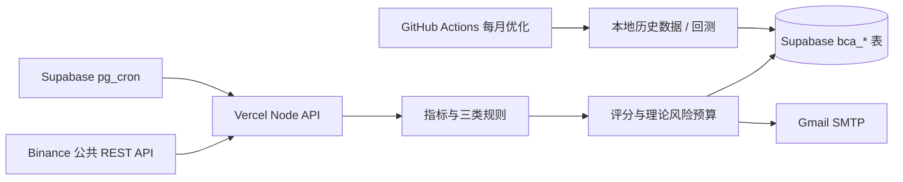

# Crypto Signal Scanner

面向 Binance USDT-M 永续合约的规则扫描、信号评分、理论止盈止损和 Gmail 提醒。当前边界是：只读取 Binance 公共行情，只发信号，不自动下单、不读取账户、不跟踪真实持仓。

## 当前实现

- 15 分钟扫描节奏；使用已收盘的 `15m`、`1h`、`4h` K 线。
- Binance 所有 USDT-M 永续合约进入轻量 universe；默认按 24 小时成交额选择前 100 个做深度技术扫描。
- 三类可复用规则：趋势、通道突破、均值回归；最终每个币种只保留评分最高的候选。
- 评分包含趋势一致性、动量、结构、流动性、波动率、市场状态适配和数据质量。
- 默认假设每笔保证金 100U、最大假设杠杆 20 倍、理论止盈 2R、参考最长持仓 72 小时。
- 单笔理论亏损超过 100U 会保留并醒目标记；每日理论风险预算 600U，预算不足的机会只入库不发邮件。
- 同一个币种只有一个 `ACTIVE` 信号；新信号评分不高于旧信号时拒绝替换，替换时只按风险增量计入每日预算。
- 每个 15 分钟扫描组最多预留 6 封邮件，每日最多 10 封；Gmail SMTP 使用 App Password。
- Supabase 写入或扫描主流程失败时，尝试绕过 Supabase 直接通过 Gmail SMTP 发送严重故障告警。
- Supabase 只保存 `bca_` 前缀的最新结果、信号事件、扫描状态和优化结果；原始历史行情放在本地 `data/raw/`，不会提交到公开仓库。

### V5 Signal Edge 状态

当前线上 Production 保持为 Control：`trend-rejection-short-v1`、SHORT 默认方向、原有评分/风控/限流均不自动切换。V5 使用独立的 `V5_SIGNAL_EDGE` shadow 通道，只有在注册表存在 `APPROVED` policy、方向批准、校准样本、成本后 Expected Net R、stress 和门禁证据齐全时，才会被标为 A；扫描路由仍不会因为 A 自动替换 Control。

V5 的候选必须同时满足：已收盘 `15m` setup、`1h/4h` 趋势确认、全局 BTC/ETH/市场 breadth 状态已知、pullback → rejection/re-break 触发，以及距离 EMA/结构、动量、波动和成交量的 no-chase 约束。LONG/SHORT 独立校准、独立 admission、独立 walk-forward 与 promotion；未知状态、缺模型或缺 policy 一律不进入生产。

Dashboard 会分别展示 Control 信号与 V5 的 A / Watch(B) / Reject(C)、market state、setup、entry trigger、policy version 和拒绝原因。V5 只写 shadow candidate / shadow paper ledger，不连接私有 API、不自动开仓或平仓。

## 架构



Vercel Hobby 的 Cron 不适合作为 15 分钟调度器，因此调度模板放在 [`supabase/scheduler.sql`](./supabase/scheduler.sql)，由 Supabase pg_cron 以 4 个批次调用 Vercel。邮件发送放在 Vercel Node runtime，因为 Supabase Edge Functions 的免费运行环境不适合 Gmail SMTP 端口。

## 本地运行

```powershell
Copy-Item .env.example .env.local
# 填入 Supabase service-role/secret key、CRON_SECRET 和 Gmail App Password
pnpm install
pnpm dev
```

健康检查：`GET /api/health`

扫描接口：`POST /api/scan?batch=0`，请求头使用 `Authorization: Bearer <CRON_SECRET>`。默认一轮深度扫描有 4 个批次：`batch=0..3`。本地测试时建议先将 `CS_DRY_RUN=true`，它不会实际发邮件。

## Supabase

迁移文件：[`supabase/migrations/20260808235907_bca_initial_schema.sql`](./supabase/migrations/20260808235907_bca_initial_schema.sql)、[`supabase/migrations/20260809000642_bca_claim_signal_fix.sql`](./supabase/migrations/20260809000642_bca_claim_signal_fix.sql)、[`supabase/migrations/20260809013349_bca_namespace_marker.sql`](./supabase/migrations/20260809013349_bca_namespace_marker.sql) 和 [`supabase/migrations/20260823160000_bca_v5_signal_edge.sql`](./supabase/migrations/20260823160000_bca_v5_signal_edge.sql)。V5 migration 只做 additive schema 变更，不 seed `APPROVED` policy；所有数据库表、函数、索引、触发器和定时任务均直接使用 `bca_` 前缀，不会创建或改名其他项目的对象：

- `bca_instruments`、`bca_scan_runs`、`bca_signals`、`bca_signal_events`
- `bca_risk_budgets`、`bca_notifications`、`bca_system_events`
- `bca_strategy_versions`、`bca_backtest_runs`、`bca_app_settings`
- `bca_policy_registry`、`bca_shadow_candidates`、`bca_shadow_paper_trades`
- `bca_claim_signal`、`bca_set_updated_at` 函数及对应索引/触发器

所有新表已启用 RLS，未给匿名用户创建策略；服务端使用 Supabase service key。不要把 service key、Gmail App Password 或 `CRON_SECRET` 放入公开仓库或 `NEXT_PUBLIC_*` 变量。

部署到 Vercel 后：

1. 在 Vercel 环境变量中设置 `.env.example` 的服务端变量；Gmail SMTP 验证成功前保持 `CS_DRY_RUN=true`，确认后再改为 `false`。
2. 在 Supabase Vault 中保存 `bca_scan_url`、`bca_paper_settle_url`、`bca_cron_secret`。若启用 Vercel Deployment Protection，再保存专用的 `bca_vercel_protection_bypass`。
3. 按 [`supabase/scheduler.sql`](./supabase/scheduler.sql) 创建 `bca-paper-settle` 和 `bca-scan-batch-0..3`。这不会改动数据库中已有的其他 Cron。

GitHub Actions 月度优化需要配置仓库 Secrets：`SUPABASE_URL`、`SUPABASE_SERVICE_ROLE_KEY` 和 `CS_HISTORY_SYMBOLS`。原始行情只存在于该次 Actions runner 的 `data/raw/`，不会写入 Supabase 或提交到公开仓库。

## 回测与参数优化

先设置 `CS_HISTORY_SYMBOLS`，再运行 `pnpm history:download` 从 Binance 公共接口下载本地历史 K 线和资金费率；建议先从 BTC/ETH 等少量代表币种开始，确认存储空间和运行时间后再扩大到更多币种。`pnpm validate` 是 V5 主验证入口：按固定 train → purged validation → frozen holdout 顺序运行，校准和参数选择只使用 train/validation，holdout 只在选择完成后评估，并输出 forward edge、MFE/MAE、R-first、T+1m/T+5m/T+15m 与 5/10/20bps stress。`pnpm validate:legacy` 保留旧报告脚本，仅用于历史对照。`pnpm optimizer` 从 `data/raw/*.json` 读取本地历史数据，按 6 个月训练 + 72 小时 purge + 3 个月 validation + 冻结 holdout 排序，不使用 holdout 选参；结果写入 `bca_strategy_versions`（兼容历史）及 `bca_policy_registry`（策略状态）。

数据文件需要包含一个 symbol、交易所过滤器和至少一年的已收盘 `15m` K 线，可选带 `1h`、`4h` K 线。数据不足一年时不会被标记为合格。原始文件被 `.gitignore` 排除。

## 风险边界

评分不是盈利保证。实盘前必须人工核对标记价格、盘口深度、滑点、手续费、资金费率、逐仓设置、实际数量精度和强平距离。系统不判断你的真实账户余额，也不会在 72 小时到期时自动平仓或发送失效通知。
